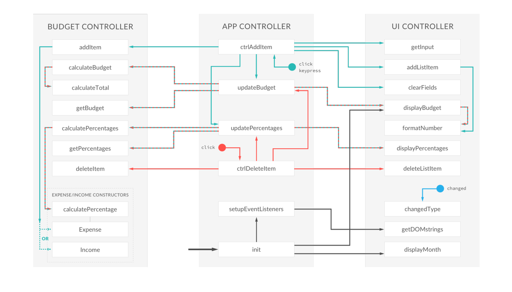

# Budgety
It is a budget calculator which calculates the total **BUDGET** using the given **INCOME** and **EXPENSES** for the current month and year.

# How to use
* Select + or - from drop-down menu.

* This will convert to either an INCOME or EXPENSE.

* Add a description and a value.

* TOTAL is calculated above.

* Hover over added item to delete.

# Architecture

